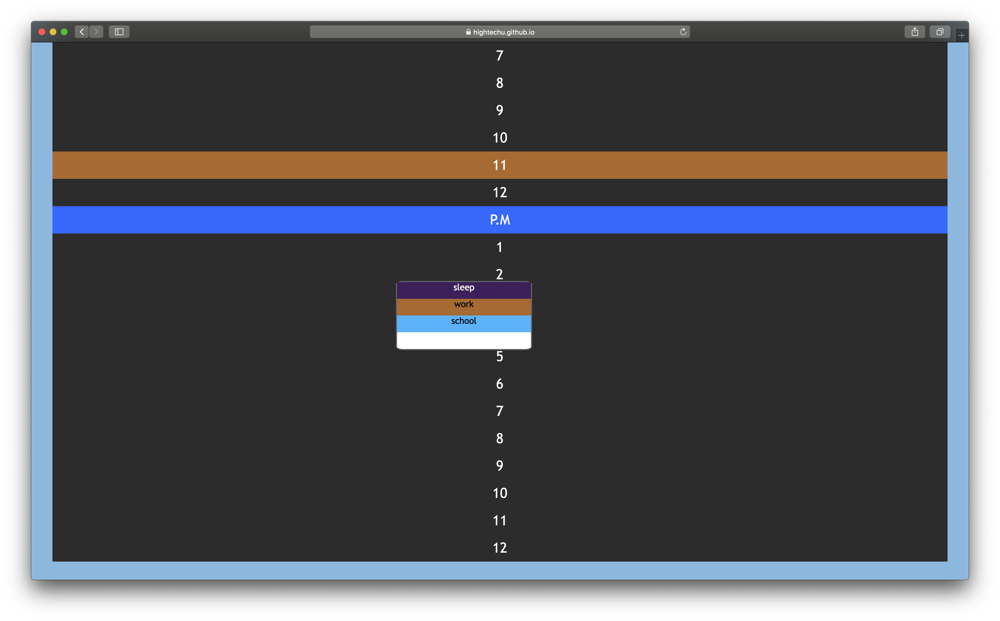
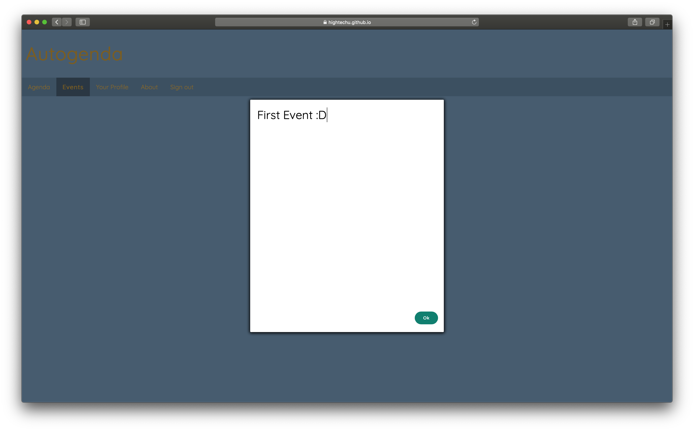

# AutoGenda

**2019 HighTechU Academy - Cohort 1**

## Website

[Live Demo](https://hightechu.github.io/hightechu-academy-autogenda/index.html)

## Mini Pitch

AutoGenda is a tool made to streamline your day, whether it comes to making plans with friends, or just for yourself, we have you covered. AutoGenda is made to help you smoothly plan and arrange your schedule, or even alongside with your friends' if you'd like. Learn about local events around you, and explore your city, with yourself or with others.  Keep planning simple, keep planning easy, AutoGenda.

## Problem Statement

A special calendar for our clients to coordinate with others available dates.

## User Stories

* I want to be able to personalise my experience in terms of having a profile (profile page).
* Customise your available date (schedule editor).
* Customise event details (event popup).
* I want to be able to log in to the platform/app (login screen).
* I want a changable time table.
* I want alerts for new events. 

## Promo

## Made with:

* HTML
* CSS
* JS

## Made by:

* Miles
* Samantha 
* Tyler
* Tyler
